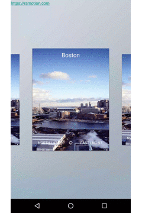

# ExpandingPager
[](https://android-arsenal.com/details/1/3747)

##only support system 5.0/latest!!!😭who can solve before 5.0 support!!!

ExpandingPager is a card peek/pop controller

[]()

####SIZE & FRAGMENT AREA


#Setup

Just extends `ExpandingViewPagerAdapter` in your Fragment Adapter and setup the ExpandingViewPager

```java
ViewPager viewPager;

@Override
protected void onCreate(Bundle savedInstanceState) {
    super.onCreate(savedInstanceState);
    setContentView(R.layout.activity_main);
    viewPager = (ViewPager) findViewById(...);
     
    viewPager.setAdapter( new CustomViewPagerAdapter(getSupportFragmentManager()) );

    ExpandingFactory.setupViewPager(ViewPager viewPager);
}
```

##Adapter

Just extends `ExpandingViewPagerAdapter` in your Fragment Adapter, which returns ExpandingFragment`

```java
public class CustomViewPagerAdapter extends ExpandingViewPagerAdapter {

    @Override
    public Fragment getItem(int position) {
        return CustomExpandingFragment.newInstance();
    }

}
```

Your `ExpandingFragment` must returns a FragmentTop and a FragmentBottom 

```java
public class CustomExpandingFragment extends ExpandingFragment {

    @Override
    public Fragment getFragmentFront() {
        return CustomFragmentTop.newInstance();
    }

    @Override
    public Fragment getFragmentBottom() {
        return CustomFragmentBottom.newInstance();
    }
}

```

##Fragments

###Top
please do not set full screen click Event,it maybe can prevent the main click Event.
```java
public class CustomFragmentTop extends Fragment  {
    
  
}
```

##Bottom

Create your top fragment implementing `ExpandingFragment.ChildTop`

```java
public class CustomFragmentBottom extends Fragment  {
    

}
```

##BackPress


```java
@Override
public void onBackPressed() {
    if(!expandingViewPager.onBackPressed(viewPager)){
        super.onBackPressed();
    }
}
```
